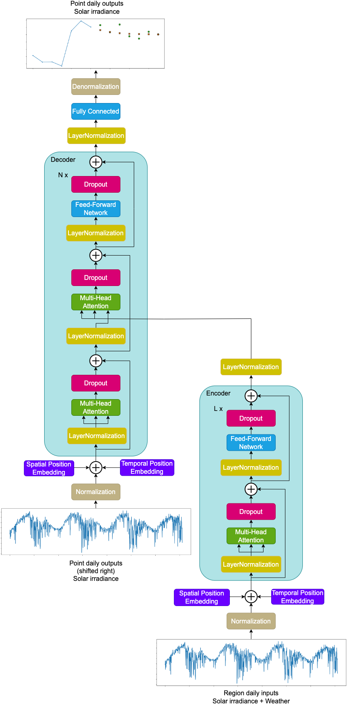
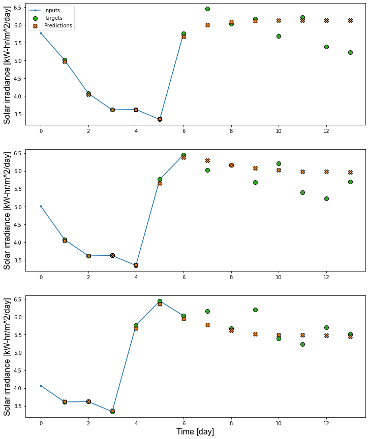

# Solar Transformer

Please check our paper [Solar Irradiance Forecasting with Transformer model
](https://www.mdpi.com/2076-3417/12/17/8852) for more details.

## Paper

  * Vaswani, A.; Shazeer, N.; Parmar, N.; Uszkoreit, J.; Jones, L.; Gomez, A.N.; Kaiser, Ł.; Polosukhin, I. Attention is all you need. Advances in neural information processing systems 2017, 30.
  * Dosovitskiy, A.; Beyer, L.; Kolesnikov, A.; Weissenborn, D.; Zhai, X.; Unterthiner, T.; Dehghani, M.; Minderer, M.; Heigold, G.; Gelly, S.; Uszkoreit, J. An image is worth 16x16 words: Transformers for image recognition at scale. 2020, arXiv preprint arXiv:2010.11929.
  * Bao, H.; Dong, L.; Wei, F. Beit: Bert pre-training of image transformers. 2021, arXiv preprint arXiv:2106.08254.
  * Brahma, B.; Wadhvani, R. Solar irradiance forecasting based on deep learning methodologies and multi-site data. Sym-metry 2020, 12(11), p.1830. Available online: https://www.mdpi.com/2073-8994/12/11/1830

## About

Solar energy is one of the most popular sources of renewable energy today. It is therefore essential to be able to predict solar power generation and adapt the energy needs to these predictions. This paper uses Transformer deep neural network model, in which the attention mechanism is typically applied in NLP or vision problems. Here it is extended by combining features based on their spatio-temporal properties in solar irradiance prediction. The results were predicted for arbitrary long-time horizons since the prediction is always 1 day ahead, which can be included at the end along the timestep axis of the input data and the first timestep representing the oldest timestep removed. A maximum worst-case mean absolute percentage error of 3.45% for the 1 day-ahead prediction was achieved, thus providing better results than the directly competing method.

## Dataset

[NASA POWER Project](https://power.larc.nasa.gov)

Solar irradiance + Weather (temperature, humidity, pressure, wind speed, wind direction)

## Model

  

## Results

  

----------------------------------

**Frameworks:** TensorFlow, NumPy, Pandas, WanDB, Seaborn, Matplotlib
